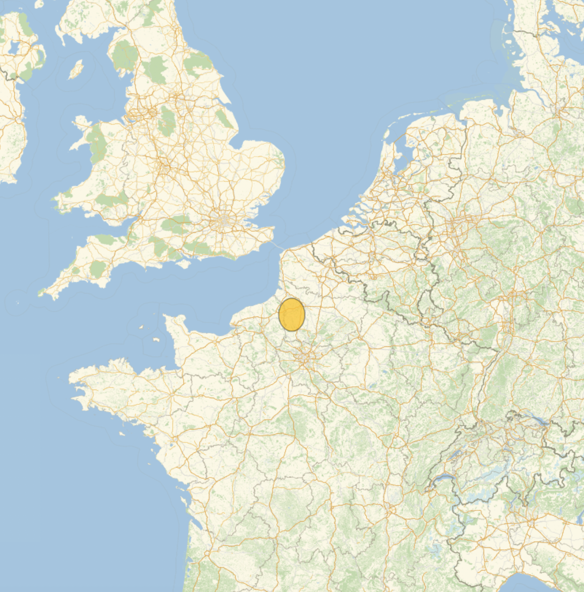
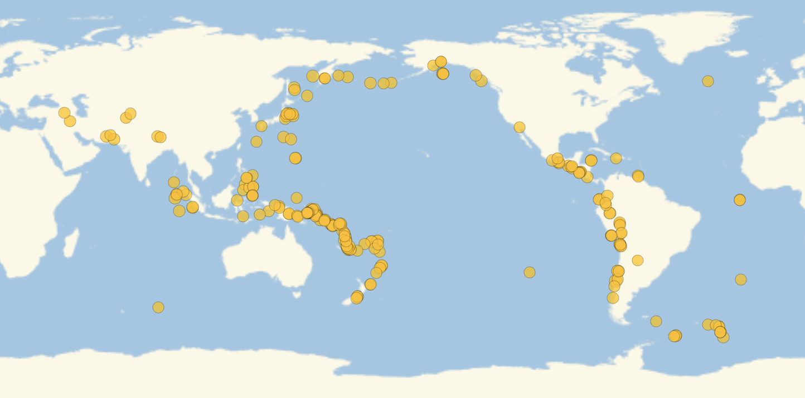
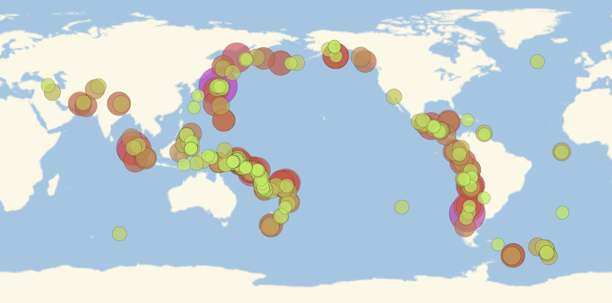
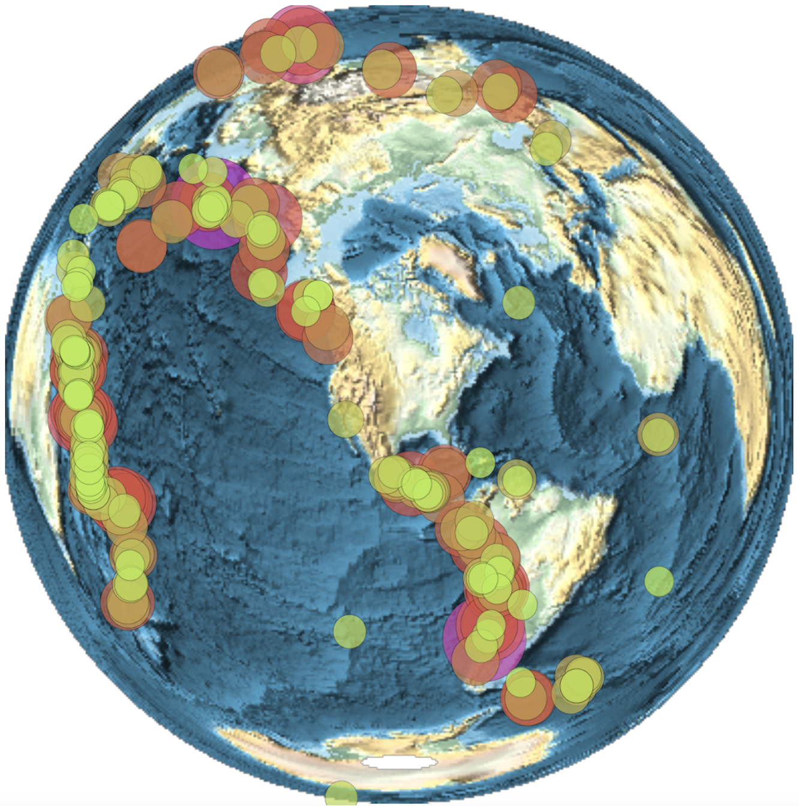

## Finding earthquakes near a location

Find (for example) earthquakes of magnitude 3 to 5 near Paris, France, from 2002 to the present:

```
EarthquakeData[Entity["City", {"Paris", "IleDeFrance", "France"}], {3, 5}, {DateObject[{2002}], DateObject[]}]
```


## Separating the data

Give the data a name:

```
earthquakeData = EarthquakeData[Entity["City", {"Paris", "IleDeFrance", "France"}], {3, 5}, {DateObject[{2002}], DateObject[]}];
```

Extract the positions and magnitudes of the earthquakes:

```
Part[earthquakeData, All, {"Position", "Magnitude"}]
```


## Plotting the data

Extract the values and rename the data:

```
earthquakeData  = Values[Values[Part[earthquakeData, All, {"Position", "Magnitude"}]]];
```

Plot the data using (for example) France as the plot range:

```
GeoBubbleChart[earthquakeData, GeoRange -> Entity["Country", "France"]]
```




## Improving the plot

Find earthquakes all around the world such that (for example) their magnitude exceeds 7 and they occurred after 2010:

```
earthquakeData =
Values[
    Values[
        Part[
            EarthquakeData[Entity["Planet", "Earth"], {7, 10}, {DateObject[{2010}], DateObject[]}],
            All,
            {"Position", "Magnitude"}
        ]
    ]
];
```



Plot the earthquakes with (for example) neon colours and scaling:

```
GeoBubbleChart[
    earthquakeData,
    GeoRange -> Entity["Planet", "Earth"],
    ColorFunction -> "NeonColors",
    BubbleSizes -> {0.05, 0.15}
]
```




## Challenges

Plot the earthquakes with:
  + the background changed to a relief map
  + the central location changed to Paris, France
  + the map projection changed to the (area-preserving) Lambert azimuthal projection

```
GeoBubbleChart[
    earthquakeData,
    GeoRange -> Entity["Planet", "Earth"],
    ColorFunction -> "NeonColors",
    BubbleSizes -> {0.05, 0.15}
    ,
    GeoBackground -> "ReliefMap",
    GeoCenter -> Entity["Country", "France"],
    GeoProjection -> "LambertAzimuthal"
]
```

