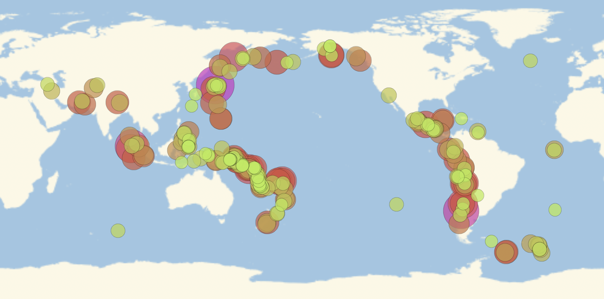

## Introduction

In this project, you will use the Wolfram Language to create a plot showing all of the major earthquakes that have occurred around the world in the last decade.

### What you will make

--- print-only ---

--- /print-only ---

--- collapse ---
---
title: What you will need
---
### Hardware

+ A computer: desktop, laptop, or a Raspberry Pi

### Software

+ Wolfram Language, available for free on the Raspberry Pi as part of the official operating system, Raspbian

--- /collapse ---

--- collapse ---
---
title: What you will learn
---

+ How to use Free-Form Input
+ How to extract data using entities and date objects
+ How to extract values from an association
+ How to plot a bubble chart

--- /collapse ---