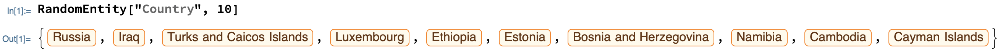
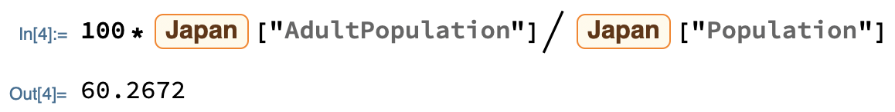
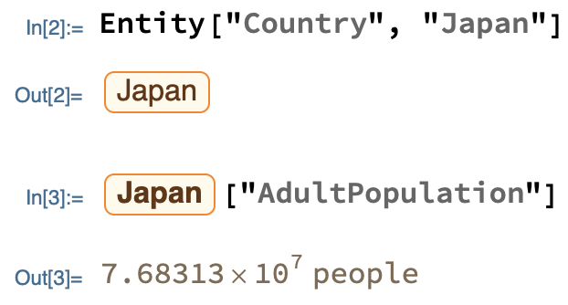

## Finding earthquakes near a location

--- task ---

If you have never used the Wolfram Language before, follow [this guide to get started](https://projects.raspberrypi.org/en/projects/getting-started-with-mathematica) and learn to use the tool. Look at the sections **Starting Mathematica** and **Programming in Mathematica**.

--- /task ---

To start, you will obtain earthquake data for a chosen location on earth.

Many locations (provided they are large or important enough) are built in to the Wolfram Language, each as an `Entity`.

--- collapse ---
---
title: Entities explained
---

Objects in the real world have properties. For example, a country has a **population**, an **area** and a **flag**; a planet has a **size**, a **colour** and a **path around the sun**.

Many objects, along with their most definitive properties, are built in to the Wolfram Language.
Such built-in objects are called **entities**, and can be identified by their yellow boxes with orange borders:



Entities are special because their properties can be extracted and computed with.
For example, we can find the number adults in Japan:



And compute it as a percentage of the total population:



Since there are many entity types (and some objects can be interpreted as more than one type), the easiest way to find a particular entity is with the Wolfram Language's Free-Form Linguistic Input.

--- task ---

In a new cell in your notebook, press `Ctrl` + `=`. This should make a little input field appear:


Type in an object (e.g. the name of a location) and hit enter.

There may be multiple interpretations of your input. If so, click the three dots to choose the one you want, then click the tick to confirm your choice.


--- /task ---

--- /collapse ---

--- task ---

Find a location entity.

--- hints ---

--- hint ---

Use free-form input.

--- /hint ---

--- /hints ---

--- /task ---

Once you have a location entity, you can find out about earthquakes near it using the `EarthquakeData[]` dataset.

--- task ---

Find earthquake data for your chosen location. If there is no data for your location, choose another one.

```
EarthquakeData[<your location entity>]
```
--- /task ---

You have just restricted your earthquake search by location. But "location" is only the first argument of `EarthquakeData[]`. There are two more: "magnitude range" and "time interval".

The magnitude of an earthquake is a number between 1 and 10 that tells you how powerful it is.


--- task ---

Find all of the earthquakes within a range of magnitudes of your choice that have occurred at your location.

```
EarthquakeData[<your location entity>, {<lower magnitude>, <upper magnitude>}]
```

--- hints ---

--- hint ---

For example, this code finds all of the earthquakes of magnitude 3 to 5 that have occurred near Paris:

```
EarthquakeData[Entity["City", {"Paris", "IleDeFrance", "France"}], {3, 5}]
```


--- /hint ---

--- /hints ---

--- /task ---

The Wolfram Language has built-in notions of date and time called date objects. These objects can represent anything from a millennium to a second.

--- task ---

Evaluate `DateObject[]` to see the date object for the current time.

Evaluate `DateObject[{1984, 11, 23}]` to see the date object for the 23rd November 1984.

--- /task ---

In order to restrict your earthquake search to a particular interval of time, you need to make sure the lower and upper bounds you provide are date objects, so that they are interpreted correctly.

--- task ---

Find all of the earthquakes that have occurred within a time interval of your choice at your location. (You must also restrict your search by magnitude.)

```
EarthquakeData[<your location entity>, {<lower magnitude>, <upper magnitude>}, {<earlier date>, <later date>}]
```

--- hints ---

--- hint ---

For example, this code finds all of the earthquakes of magnitude 3 to 5 that have occurred near Paris since 2002:

```
EarthquakeData[Entity["City", {"Paris", "IleDeFrance", "France"}], {3, 5}, {DateObject[{2002}], DateObject[]}]
```


--- /hint ---

--- /hints ---

--- /task ---