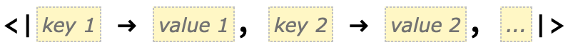
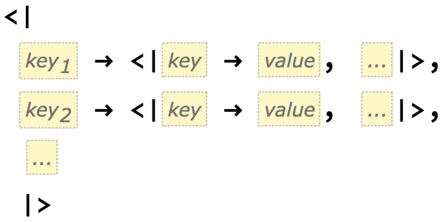
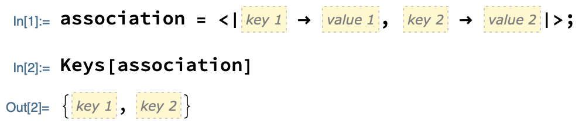
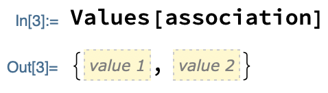
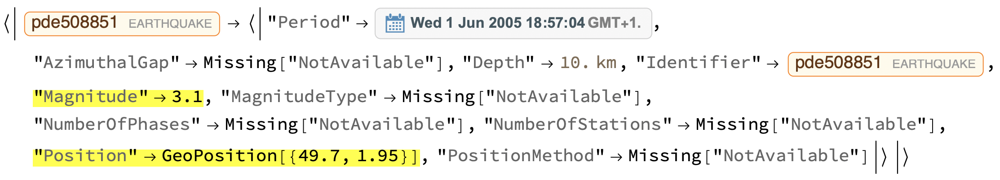

## Separating the data

So far, you have learned how to obtain a list of all the earthquakes of a given magnitude that have occurred near a given location at a given time.

Your aim is now to plot the results. To do so, you are going to need exact information: the precise position and magnitude of each earthquake.
Luckily, you already have these pieces of information--they just need extracting from your data.


Look at the earthquake data you have obtained. You'll notice that it has some unusual brackets around it: `<|` and `|>`. These brackets tell you that the data is in the form of an `Association`.
An association is a special way of representing categorical data.

(Note that the brackets in a regular list of data are curly: `{` and `}`.)

In fact, you'll see that there are multiple sets of these brackets: an "outer" set and one or more "inner" sets. In other words, your data is made from an association with one or more associations inside it.
This suggests that your data has sub-categories.

--- collapse ---
---
title: Associations explained
---

Data inside an association comes in pairs. Each pair consists of a `Key` (a category) followed by a `Value` (information **associated** with that category):



Much in the way lists can be put inside each other, so can associations--although each inner association needs to have its own key:



When associations are put inside one another like this, they are said to be **nested**.

Parts of an association can be extracted with a few different functions:
+ `Keys` finds every category name
+ `Values` finds the information in every category
+ `Lookup` find the piece of information for a particular category
+ `Part` finds the pieces of information for one or more categories or at one or more **positions**

For now, let's just look at the first two of these.
As the name would suggest, `Keys` extracts all of the keys from an association:



Likewise, `Values` extracts all of the values:



--- task ---

Extract the keys and values from the following association:

```
animals = <| "Dogs" -> 6, "Cats" -> 3, "Ducks" -> 2, "Hamsters" -> 4, "Fish" -> 10|>;
```

--- hints ---

--- hint ---

You should get the following keys:

```
{"Dogs", "Cats", "Ducks", "Hamsters", "Fish"}
```

--- /hint ---

--- hint ---

You should get the following values:

```
{6, 3, 2, 4, 10}
```

--- /hint ---

--- /hints ---

--- /task ---

--- /collapse ---

In the case of your data, the categories are the (somewhat peculiar) names of the earthquakes, such as "pde508851", each of which is sub-categorised by their "Period", "AzimuthalGap", "Depth" and so on.


As you can see, each sub-category is paired with a piece of specific information about an earthquake. You need information from the "Position" and "Magnitude" sub-categories.




If (as is the case with your data) there are several associations inside one another, `Keys`, `Values` and `Lookup` will only search in the outermost association.
However, `Part` can penetrate nested associations to any depth.
For this reason, you will use `Part` to separate the "Position" and "Magnitude" sub-categories from the rest of the earthquake data.

--- collapse ---
---
title: Part explained
---

`Part` extracts part of an **expression**. The expression is usually some sort of data, but `Part` works on a lot of functions, too. The part being extracted might be a single item, or it might be several items that match some pattern.

More specifically, the data is usually a list or association (or a list of lists or a nested association) and items are extracted by their position, such as "4th item in the list".

For associations, `Part` has the extra property of being able to extract items by **category name** as well as position.
(`Part` also works on lists, but that's not important right now.)

`Part` is best understood with examples.

--- task ---

Evaluate this code to define a nested association.

```
exampleAssoc = <|
"A" -> <|"a1" -> 1, "b1" -> 2|>,
"B" -> <|"a2" -> 3, "b2" -> 4|>,
"C" -> <|"a3" -> 5, "b3" -> 6|>
|>
```

Evaluate this to extract the information from the first category with its position.

```
Part[exampleAssoc, 1]
```

Evaluate this to extract the information from the same category with its name.

```
Part[exampleAssoc, "A"]
```

Evaluate this to extract the first piece of information from each category. (In other words, the first "column" of data.)

```
Part[exampleAssoc, All, 1]
```

(Note that in this case, the category names have also been pulled out.)

Evaluate this to extract the pieces of information associated with the sub-categories "a2 and "b2" from the second category ("B").

```
Part[exampleAssoc, 2, {"a2", "b2"}]
```

--- /task ---

Try experimenting with the values used in the examples above--especially the "column" example, as this is a tricky case.

--- /collapse ---

--- task ---

Give your data a name.

```
earthquakeData = EarthquakeData[<your location entity>, {<lower magnitude>, <upper magnitude>}, {<earlier date>, <later date>}];
```

(The semicolon after the input "suppresses" the output. The calculation still takes place, but no output is printed.)

Use `Part` to extract the position and magnitude of each earthquake.

```
Part[earthquakeData, <positions or category names>]
```

--- hints ---

--- hint ---

You want to extract **all** of the positions and magnitudes, so you will need to use `All`.

--- /hint ---

--- hint ---

You can extract the positions and magnitudes by name (`{"Position", "Magnitude"}`) or by position (`{9, 5}`).

--- /hint ---

--- hint ---

The code you need is:

```
Part[earthquakeData, All, {"Position", "Magnitude"}]
```

--- /hint ---

--- /hints ---

--- /task ---