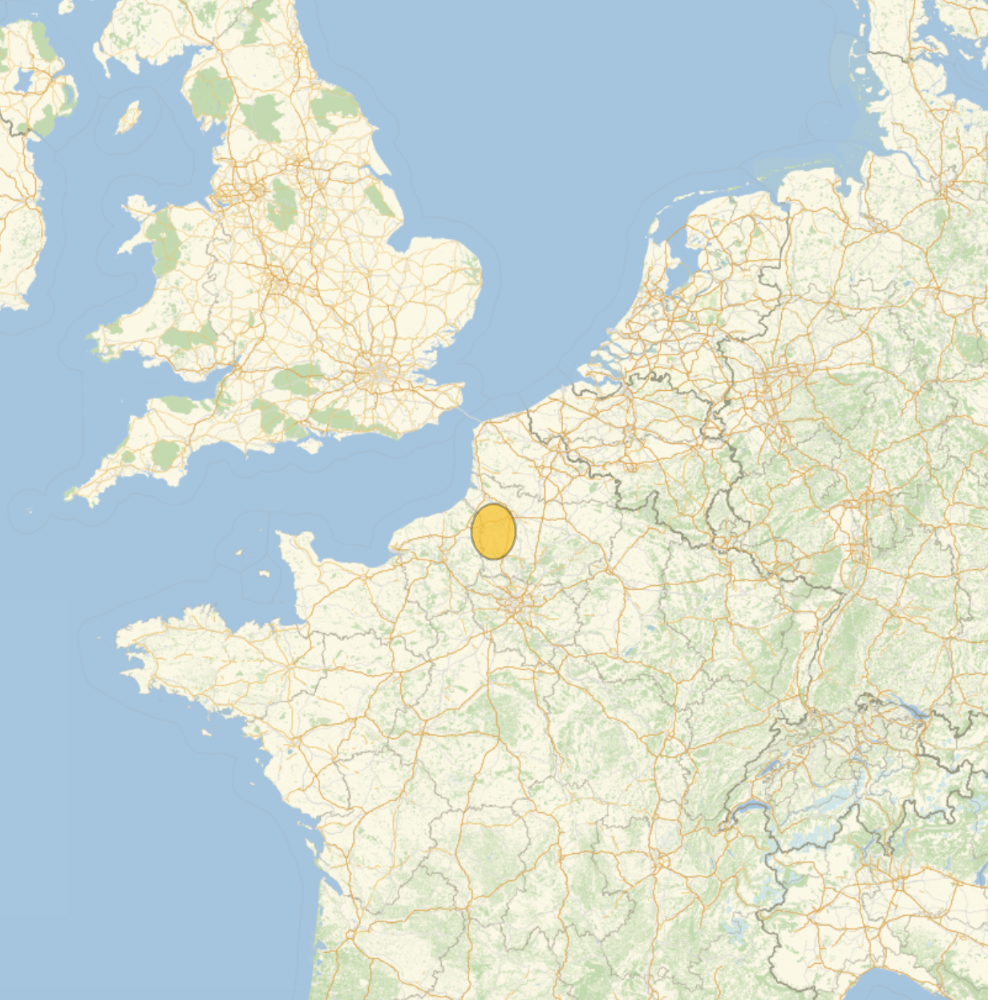

## Plotting the data

You should now have a smaller set of data. In order to extract the specific information you need for plotting, you **could** use `Part` again, but a more suitable function to use in this case is `Values`.

Remember, if there are associations inside associations, `Values` only works on the outermost one.

--- tast ---

Use `Values` to obtain a list of {position, magnitude} pairs.

```
Values[<data>]
```


--- hint ---

You need to apply `Values` twice.

--- /hint ---

--- /task ---

You now have the data in the required form for plotting the earthquakes on a map.


For this, you can use `GeoBubbleChart`.

--- task ---

Rename your data.

```
earthquakeData = <latest data>;
```

Use `GeoBubbleChart` to plot the data.
The plot range is determined by the `GeoRange` option. Set this range by typing a distance or location into a Free-Form input field.
For example, press `Ctrl` + `=` and, in the box that appears, type "1000 miles" or "world". (You may have to adjust the range to see the bubble clearly.)

```
GeoBubbleChart[earthquakeData, GeoRange -> <distance or location>]
```



--- /task ---