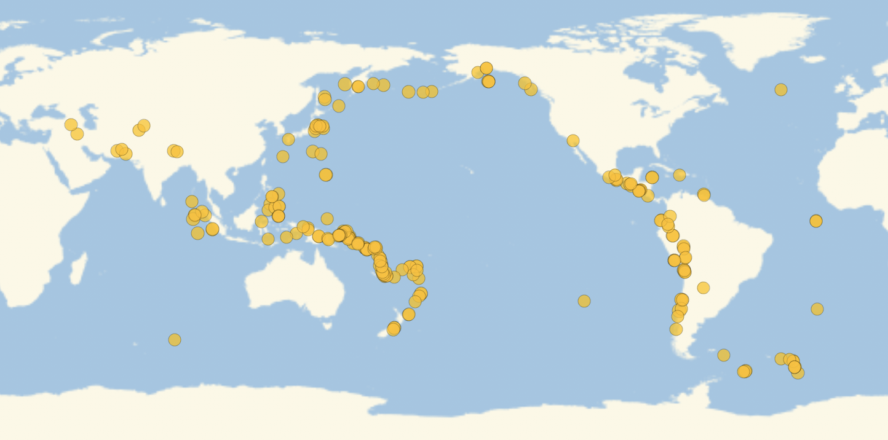

## Improving the plot

You should now have a plot showing a number of earthquakes that have occurred near a single location on earth. It's time to broaden your sights!

--- task ---

Change your earthquake location to the whole world.
You may also wish to change the range of magnitudes or the time interval.

```
earthquakeData =
Values[
    Values[
        Part[
            EarthquakeData[<the world>, {<lower magnitude>, <upper magnitude>}, {<earlier date>, <later date>}],
            All,
            {"Position", "Magnitude"}
        ]
    ]
]
```

--- hints ---

--- hint ---

Create a Free-Form input field and type "world" or "earth".

--- /hint ---

--- /hints ---

--- /task ---

You should now have a much longer list of {position, magnitude} pairs.

--- task ---

Plot the new data.



--- /task ---

In your plot, you might find it difficult to distinguish earthquakes of different magnitudes, as all of the bubbles are the same colour and similar in size. Luckily, both of these characteristics can be changed easily with options in `GeoBubbleChart`.

--- task ---

Use the `ColorFunction` option to choose a colour palette for the bubbles.
Colour palettes can be found by evaluating `ColorData["Gradients"]`.


--- hints ---

--- hint ---

Try `ColorFunction -> "NeonColors"`

--- /hint ---

--- /hints ---

--- /task ---

--- task ---

Use the `BubbleSizes` option to increase the range of bubble sizes. (A wider range will produce more variety.)
It is recommended that both numbers are less than 0.5.


--- hints ---

--- hint ---

Try `BubbleSizes -> {0.05, 0.15}`

--- /hint ---

--- /hints ---

--- /task ---

Congratulations! You have created your own earthquake map.